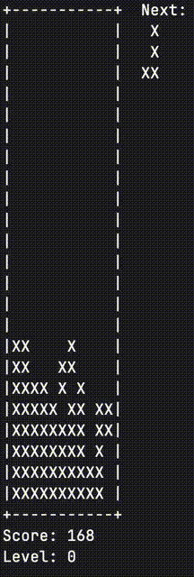

# tetri.sh

```
wget https://raw.githubusercontent.com/psykulsk/tetri.sh/main/tetri.sh
bash tetri.sh -h
usage: tetri.sh [-c cols ] [-r rows] [-s speed]
controls: left, right and down arrows for movement, z and x for rotation
  -h display help
  -c cols specify game area cols. Make sure it's not higher then the actual terminal's width. 
  -r rows specify game area rows. Make sure it's not higher then the actual terminal's height.
  -s speed specify game speed. Value from 1-10.
```

Requires `bash --version` >= 4.0.

### Other bash games
* [shnake](https://github.com/psykulsk/shnake)

### Demo


